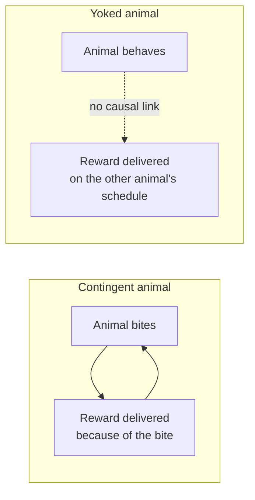
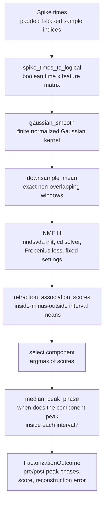
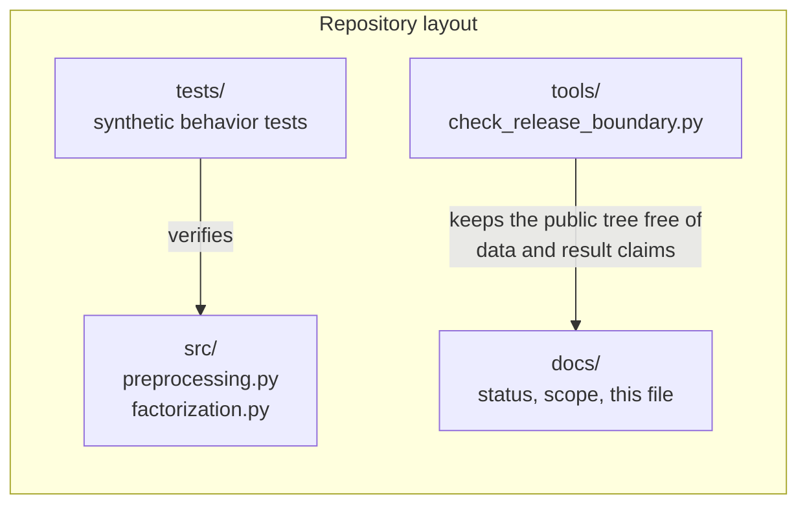

# Extended Introduction: Temporal Credit Assignment in *Aplysia*

This document is a from-scratch introduction for readers with **no neuroscience background and no mathematical background**. Every quantitative idea is first carried out as an explicit, finite procedure on a few numbers you could check by hand, and only then named. For the shorter, technical introduction with formal citations, see [docs/INTRODUCTION.md](INTRODUCTION.md).

**Concept figure.** The experiment and the analysis — contingent versus yoked reward, additive decomposition of the recording, and the peak-timing question — are drawn in [concept_figure.md](concept_figure.md) as an embedded Mermaid diagram. (The release boundary does not allow image files in the tracked tree, so the figure lives as text.)

## 1. The sea slug that taught us about learning

*Aplysia californica* is a large sea slug. It is famous in biology for a simple reason: its nervous system is small and its neurons are enormous. Where a human brain has on the order of 86 billion neurons, *Aplysia* has on the order of 20,000, and some of them are so large (up to a millimeter across) that you can see them with the naked eye and record from the same identified cell, in the same location, in animal after animal. That tractability made *Aplysia* a workhorse of learning research — the body of work for which Eric Kandel received a share of the 2000 Nobel Prize in Physiology or Medicine.

Think of it this way. If you wanted to understand how a factory works, you would rather start with a workshop of twenty machines you can each name and watch than with a city of a billion machines you cannot distinguish. *Aplysia* is that workshop. In particular, its **feeding network** — the small set of neurons that drives the animal's biting and swallowing — can be recorded while the animal learns, and the same experiment can be repeated on an isolated preparation of that network [9].

## 2. Operant learning: "do something, get a reward"

**Operant learning** (also called instrumental conditioning) is the kind of learning where an animal discovers that its own action produces a consequence. A rat presses a lever and gets food; it presses more. A sea slug performs a biting movement and receives a reinforcing nerve stimulation; the pattern of its feeding movements changes [2].

The key experimental trick is the **yoked control**. Two animals receive the *same* rewards on the *same* schedule. For the **contingent** animal, the reward is caused by its own behavior. For the **yoked** animal, rewards arrive on a recording of the first animal's schedule, regardless of what the yoked animal does. Both animals experience identical reward timing; only the *relationship between action and reward* differs. If the two animals end up behaving or firing differently, the difference must come from contingency — from the animal's own action being the cause — rather than from reward exposure alone.

## 3. Temporal credit assignment: which earlier signal caused the later outcome?

Here is a puzzle you already know from daily life. You eat a meal with ten ingredients; two hours later you feel sick. Which ingredient was responsible? The outcome is delayed, and everything that happened beforehand is a suspect. Assigning credit to the right earlier cause is the **temporal credit-assignment problem** [1].

A nervous system faces this constantly. Neural activity unfolds continuously, and a reward arrives at one moment. The brain must decide which earlier patterns of activity deserve to be strengthened. One formal family of solutions, temporal-difference learning, assigns credit by comparing each moment's prediction with the next moment's — propagating credit backward step by step rather than waiting for the final outcome [8]. The step-by-step logic is the same as the fading-sticky-note arithmetic worked out in the sibling synthesis project's documentation: each past event keeps a number that decays every step, and a late outcome updates events in proportion to what is left.

This repository studies a concrete version of the question: after operant training in *Aplysia*, does the *timing* of a neural activity pattern shift in the contingent animals relative to the yoked controls — for example, does a component of population activity peak *earlier* within each behavior cycle?

## 4. Non-negative matrix factorization: splitting a smoothie into ingredients, by hand

A recording of many neurons over time is a big table of numbers: one row per time point, one column per neuron. It is hard to look at directly. **Non-negative matrix factorization (NMF)** is a way to summarize it [5].

The recipe analogy: imagine you taste a smoothie and want to recover the recipe. NMF assumes the smoothie (the full recording) is a blend of a small number of *pure ingredients* (recurring spatial patterns across neurons), each added in a *time-varying amount* (how strongly that pattern is active at each moment). The non-negativity rule says you can only *add* ingredients, never subtract them — which matches neural firing, since a neuron cannot fire a negative number of spikes.

Here is the whole mechanism on four numbers. Suppose two neurons are recorded for two time points, giving the table: neuron 1 reads (4, 0) and neuron 2 reads (0, 6) at times (1, 2). That table can be written exactly as a sum of two ingredients:

- ingredient A: pattern "neuron 1 only," switched on with strength 4 at time 1 and 0 at time 2;
- ingredient B: pattern "neuron 2 only," switched on with strength 6 at time 2 and 0 at time 1.

The recording equals (strength × pattern) added over ingredients — four multiplications and two additions, nothing else. Real NMF is this same bookkeeping for the case where no exact split exists: the computer proposes strengths and patterns, measures the squared mismatch in every table cell, adds those squares up, and adjusts the proposal until that total mismatch stops shrinking. "Fit" means "we ran that adjustment loop and kept the best attempt," not "we found the true ingredients." A component is a *statistical description*, not a discovered neuron or mechanism [4]; it is a useful compression whose timing can be measured objectively, but calling it biology requires more than a good fit [6].

## 5. The timing score, computed once explicitly

The repository's contrast uses two tiny recipes, both of which fit in a margin.

**Retraction-association score.** For each component, subtract its average activity *outside* the behavior intervals from its average *inside* them. Example: a component's activity during three biting intervals is 5, 7, 6 (inside mean = 18/3 = 6) and at three moments outside them is 2, 3, 1 (outside mean = 6/3 = 2). The score is 6 − 2 = 4: positive, so the component is enriched during biting. `fit_primary_factorization` selects the component with the largest score — literally the argmax of a short list of such differences.

**Median peak phase.** Within each behavior interval, find where the selected component reaches its maximum, expressed as a fraction of the interval (0 = start, 1 = end, ties broken toward the earliest maximum), then take the median across intervals so one odd interval cannot dominate. Example: peaks at fractions 0.6, 0.5, 0.7 before training ("pre") sort to 0.5, 0.6, 0.7 with median 0.6; after training ("post") peaks at 0.3, 0.4, 0.5 give median 0.4. The scientific contrast is then one subtraction per matched pair: post-minus-pre peak phase for the contingent animal minus the same difference for its yoked partner. Negative means the contingent animal's component shifted earlier relative to its partner's.

That is the entire quantitative core of the project: means, differences, a middle value, and subtractions.

## 6. Why synthetic time series with known ground truth?

Here is the deepest problem in testing an analysis method: with real data, you never know the right answer. If your method says "component 2 peaks early," is that true of the neurons, or an artifact of your smoothing?

The escape is **synthetic data**. An Aplysia-inspired time series is generated in code — spike times, smoothing, intervals — so the ground truth is known by construction, and the tests check whether the code recovers what was planted. Every test in `tests/` builds a tiny in-memory array with a known answer (for example, `test_retraction_association_scores_favors_interval_enrichment` plants a component enriched in a known interval and checks that the scoring rule finds it). These tests verify **code behavior**; they do not, by themselves, prove anything about real animals. The repo says this explicitly in its [methods scope](METHODS_SCOPE.md), and its open issues (#9–#14) ask for more synthetic tests of exactly this kind.

## 7. How the pieces fit together

The pipeline above is literally `fit_primary_factorization` in `src/factorization.py`. It is run separately on a "pre" (before-training) and "post" (after-training) activity segment, and the scientific contrast compares the selected component's peak phase between them, for a contingent animal versus its yoked partner — the subtraction recipe of section 5.

## 8. The math that is actually used — one sentence each

Each named resource below is free; search for it by title.

- **NMF objective (Frobenius loss).** Find non-negative strength and pattern tables whose product reproduces the recording, where "reproduces" is measured by summing the squared mismatch of every cell — the adjustment loop of section 4, run by a library instead of by hand. *(Learn: the StatQuest videos on matrix factorization; the 3Blue1Brown series Essence of Linear Algebra for the multiplication intuition.)*
- **Retraction-association score.** Inside-interval mean minus outside-interval mean, one subtraction per component — worked out in section 5. *(Learn: the Khan Academy unit on measures of central tendency.)*
- **Median peak phase.** The peak position within each interval as a fraction, then the middle value across intervals — worked out in section 5. *(Learn: the Khan Academy unit on the median; the Seeing Theory interactive statistics chapters.)*
- **Gaussian smoothing.** Replace each spike moment with a small bell-shaped bump of fixed width (standard deviation 1000 samples, finite half-window 2500 samples, renormalized so the bumps' weights sum to one) and add the bumps up, turning sharp events into a smooth activity level — like replacing camera flashes with a gentle brightness curve.

## 9. What this project concluded — and did not

The completed re-analysis produced a **directionally negative** contingent-minus-yoked timing pattern in most matched pairs, and the direction survived leaving any single pair out. But the contrast was not stable under the planned component-count and smoothing sensitivity checks, and a comparison with an archived reference workflow agreed only partially. The honest bottom line, stated in the README and [status document](STATUS_AND_PLAN.md), is: **directionally suggestive but inconclusive**. No causal, mechanistic, or exact-replication claim is made, and the reference MATLAB/seqNMF workflow was not rerun.

## References

All literature citations above refer to the numbered, verified reference list in [docs/INTRODUCTION.md](INTRODUCTION.md), which is the repository's single citable source list. The entries used here are: Friedrich, Urbanczik, and Senn 2011 [1]; Brembs et al. 2002 [2]; the population-recording study of operant learning dynamics [3]; Cunningham and Yu 2014 [4]; Lee and Seung 1999 [5]; Mackevicius et al. 2019 [6]; Sutton 1988 [8]; Nargeot, Baxter, and Byrne 1999 [9]. Per the release boundary, this document contains no external addresses or identifier links — find each source by author, year, and title in that list. No citations beyond it are made in this document.
