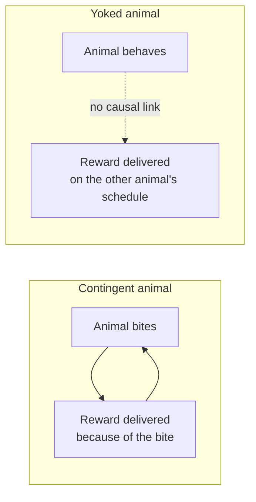
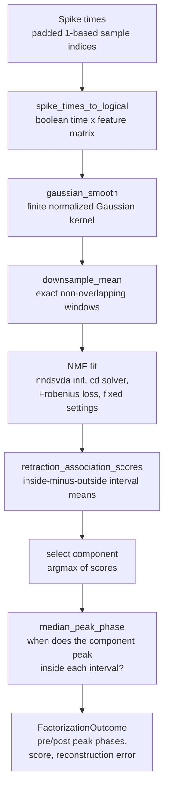
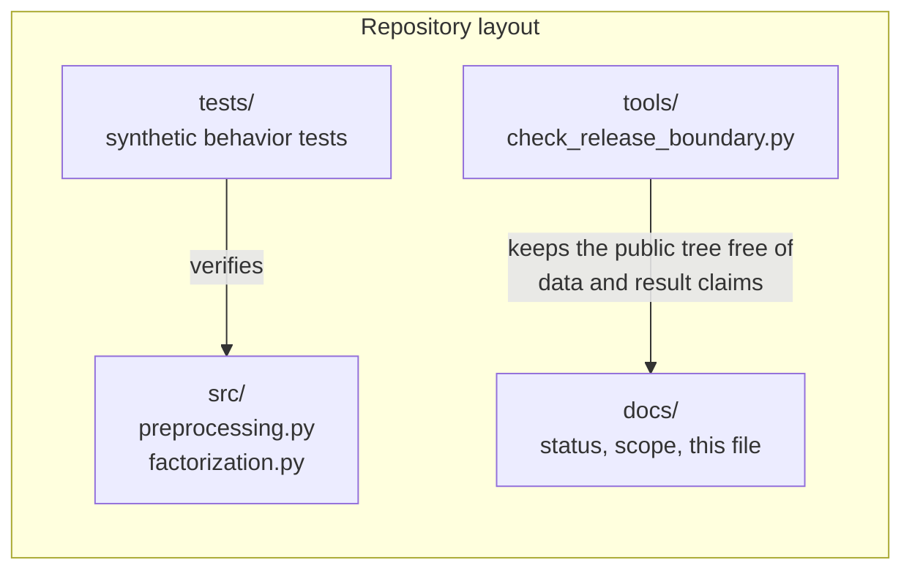

# Extended Introduction: Temporal Credit Assignment in *Aplysia*

This document is a from-scratch introduction for readers with **no neuroscience background and no mathematical background**. Every quantitative idea is first carried out as an explicit, finite procedure on a few numbers you could check by hand, and only then named. For the shorter, technical introduction with the full literature list, see [docs/INTRODUCTION.md](INTRODUCTION.md).

Because no single mental model suits everyone, each core concept below ends with a **"many roads"** subsection: several independent mathematical lenses on the same idea, each with one tiny fully-worked example. Take whichever road matches your intuition and skip the rest. All of them use nothing beyond counting, sets, and tables — no calculus, no differential equations.

**Concept figure.** The experiment and the analysis — contingent versus yoked reward, additive decomposition of the recording, and the peak-timing question — are drawn in [concept_figure.md](concept_figure.md) as an embedded Mermaid diagram. (The release boundary does not allow image files in the tracked tree, so the figure lives as text.)

## Start here: the math toolkit from zero

Every mathematical object used in this document is defined in this section — three plain sentences or fewer each, plus one tiny numeric example you can check with pencil and paper. Nothing outside this section is assumed; if a symbol later looks unfamiliar, come back here.

- **Variable.** A variable is a named slot that holds a number, like a labeled jar. The label stays; the contents can change. Example: let $`m`$ hold 1; after one decay step it holds 0.5, still in the jar called $`m`$.
- **Subscript.** A subscript is a position label on a letter: $`x_3`$ means "the $`x`$-value at time 3." One letter then names a whole line of numbers. Example: if a trace reads 4, 0 across two time points, then $`x_1 = 4`$ and $`x_2 = 0`$.
- **Function.** A function is a machine with one fixed rule: feed it a number, it returns a number. $`f(x)`$ means "the machine's output when fed $`x`$." Example: $`f(x) = 0.5x`$ gives $`f(1) = 0.5`$ and $`f(0.5) = 0.25`$.
- **Set and membership.** A set is a collection of distinct things in curly braces; $`\in`$ means "is a member of," and a complement is everything not in the set. Example: with moments $`\{1,\dots,6\}`$ and inside set $`\{2,4,5\}`$, the complement is $`\{1,3,6\}`$ and $`4 \in \{2,4,5\}`$.
- **Sum, the symbol $`\sum`$.** The symbol $`\sum`$ means "add up everything in this range"; the labels say where counting starts and stops. Example: $`\sum_{i=1}^{3} x_i`$ with values 5, 7, 6 gives $`5 + 7 + 6 = 18`$.
- **Probability as a fraction of cases.** A probability is a count of favorable cases over a count of all cases, between 0 and 1. A conditional probability restricts the count to the occasions matching a condition. Example: if reward followed pattern X in 45 of 50 episodes, $`P(\text{reward} \mid X) = 45/50 = 0.9`$.
- **Average (mean).** A mean is a total divided by how many items you added — the equal share. Example: the mean of 5, 7, 6 is $`(5+7+6)/3 = 18/3 = 6`$.
- **Median.** A median is the middle value after sorting: half the values lie at or below it, half at or above. Example: sorting 0.6, 0.5, 0.7 gives 0.5, 0.6, 0.7, whose median is 0.6.
- **Matrix (a table).** A matrix is a table of numbers in rows and columns. A recording is a matrix: one row per time point, one column per neuron. Example: the table with row "time 1" reading (4, 0) and row "time 2" reading (0, 6) is a 2-by-2 matrix.
- **Weighted sum.** A weighted sum multiplies each item by a chosen weight and adds the results. Every cell of a factorization is a small weighted sum over ingredients. Example: weights (4, 0) on presence flags (1, 1) give $`4 \times 1 + 0 \times 1 = 4`$.
- **argmax, the input that wins.** $`\arg\max`$ means "the choice at which the expression is largest" — the winner, not the top value. Example: if component scores are 4, 1, 2, the $`\arg\max`$ is component 1 (whose score is 4).
- **Fixed point.** A fixed point of a rule is a value the rule leaves unchanged — output equals input. Example: the adjustment rule "move toward zero mismatch" is fixed at mismatch 0, because there is nothing left to adjust.
- **Feedback loop / iteration.** Iteration is applying one rule to its own output, repeatedly — one row of a table per application. Example: iterating $`m \to 0.5\,m`$ from 1 gives $`1 \to 0.5 \to 0.25 \to 0.125`$, the fading mark used throughout this document.
- **$`\log_2`$, the number of halvings.** $`\log_2(n)`$ asks how many times you can halve $`n`$ before reaching 1 — the number of yes/no questions that pin down one of $`n`$ equally likely options. Example: $`\log_2(8) = 3`$, because $`8 \to 4 \to 2 \to 1`$ is three halvings.

## 1. The sea slug that taught us about learning

*Aplysia californica* is a large sea slug. It is famous in biology for a simple reason: its nervous system is small and its neurons are enormous. Where a human brain has on the order of 86 billion neurons, *Aplysia* has on the order of 20,000, and some of them are so large (up to a millimeter across) that you can see them with the naked eye and record from the same identified cell, in the same location, in animal after animal. That tractability made *Aplysia* a workhorse of learning research — work recognized with a share of a Nobel Prize in the year 2000.

Think of it this way. If you wanted to understand how a factory works, you would rather start with a workshop of twenty machines you can each name and watch than with a city of a billion machines you cannot distinguish. *Aplysia* is that workshop. In particular, its **feeding network** — the small set of neurons that drives the animal's biting and swallowing — can be recorded while the animal learns, and the same experiment can be repeated on an isolated preparation of that network [9].

## 2. Operant learning: "do something, get a reward"

**Operant learning** (also called instrumental conditioning) is the kind of learning where an animal discovers that its own action produces a consequence. A rat presses a lever and gets food; it presses more. A sea slug performs a biting movement and receives a reinforcing nerve stimulation; the pattern of its feeding movements changes [2].

The key experimental trick is the **yoked control**. Two animals receive the *same* rewards on the *same* schedule. For the **contingent** animal, the reward is caused by its own behavior. For the **yoked** animal, rewards arrive on a recording of the first animal's schedule, regardless of what the yoked animal does. Both animals experience identical reward timing; only the *relationship between action and reward* differs. If the two animals end up behaving or firing differently, the difference must come from contingency — from the animal's own action being the cause — rather than from reward exposure alone.



### The many roads to a yoked control

**Road 1: set theory.** The design holds one set identical across animals — the set of reward times {t1, t2, t3, …} — and varies exactly one membership fact: in the contingent animal, each reward time is a member of the set "moments caused by this animal's own bites"; in the yoked animal it is not. Every difference in outcome must be blamed on that single changed membership, because every other set was copied. Formally,

```math
\text{rewards}_{\text{cont}} = \text{rewards}_{\text{yoked}} = \{t_1, t_2, t_3, \ldots\}, \qquad t_i \in \text{caused-by-own-bite} \iff \text{contingent}
```

where the first line says the reward-time sets are identical, and the second says membership in the caused set holds exactly for the contingent animal — the experiment is this one membership difference and nothing else. *What this buys you:* the logic of the control as one symmetric-difference computation — what differs between the two conditions is a set you can name. *What it costs you:* sets assume the copying was perfect; if the yoked schedule drifts, the "identical" claim fails silently.

**Road 2: game theory.** Contingency is a payoff table with your action as a row. The contingent animal faces: (bite, reward) = +1, (bite, no reward) = 0, (rest, reward) = 0, (rest, no reward) = 0 — rewards live only in the "bite" row, so the best strategy is to bite. The yoked animal faces a table where both rows average the same reward rate, so no strategy changes its payoff. Learning "bite more" is rational only in the first table. Formally, the value of an action $`a`$ is its average payoff,

```math
V(a) = \sum_{\text{outcomes } o} P(o \mid a)\, \text{payoff}(a, o), \qquad V_{\text{cont}}(\text{bite}) = 1 \times 1 = 1 > V_{\text{cont}}(\text{rest}) = 0
```

where $`P(o \mid a)`$ is the fraction of times outcome $`o`$ followed action $`a`$ — in the contingent table the bite row earns 1 while the rest row earns 0, and in the yoked table both rows earn the same, so the inequality flips to equality. *What this buys you:* contingency as *action-dependent payoffs* — the difference between the two animals is whether actions move you between rows that matter. *What it costs you:* real animals do not read payoff tables; the lens describes what would be learned, not how.

**Road 3: automata.** Each animal is a state machine, and the experiment copies every transition rule except one edge. Contingent machine: state "just bit" + input "reward" → strengthen biting. Yoked machine: that edge is deleted; reward inputs loop back without changing anything. Comparing the two machines' long-run behavior isolates the effect of the single deleted transition. Formally the two machines share one transition table $`\delta`$ except for one row,

```math
\delta_{\text{cont}}(\text{just bit}, \text{reward}) = \text{strengthen biting}, \qquad \delta_{\text{yoked}}(\text{just bit}, \text{reward}) = \text{unchanged}
```

where $`\delta(\text{state}, \text{input})`$ gives the next state — the two machines differ in exactly this one row, which is the whole design. *What this buys you:* the experiment as a diff between two machines — one edge. *What it costs you:* a machine has sharp states; a real animal's "just bit" is fuzzy and graded.

## 3. Temporal credit assignment: which earlier signal caused the later outcome?

Here is a puzzle you already know from daily life. You eat a meal with ten ingredients; two hours later you feel sick. Which ingredient was responsible? The outcome is delayed, and everything that happened beforehand is a suspect. Assigning credit to the right earlier cause is the **temporal credit-assignment problem** [1].

A nervous system faces this constantly. Neural activity unfolds continuously, and a reward arrives at one moment. The brain must decide which earlier patterns of activity deserve to be strengthened. One formal family of solutions, temporal-difference learning, assigns credit by comparing each moment's prediction with the next moment's — propagating credit backward step by step rather than waiting for the final outcome [8]. The step-by-step logic is the same as the fading-sticky-note arithmetic worked out in the sibling synthesis project's documentation: each past event keeps a number that decays every step, and a late outcome updates events in proportion to what is left.

This repository studies a concrete version of the question: after operant training in *Aplysia*, does the *timing* of a neural activity pattern shift in the contingent animals relative to the yoked controls — for example, does a component of population activity peak *earlier* within each behavior cycle?

### The many roads to temporal credit assignment

**Road 1: discrete iterated maps.** Give each past event a mark that evolves by one rule: mark_next = 0.5 × mark_now + (1 if the event happens now, else 0). A bite at time 0 leaves marks 1, 0.5, 0.25, 0.125 at times 0–3. If a reward worth 8 arrives at time 3, the update credited to that bite is 8 × 0.125 = 1, while an event one step old gets 8 × 0.25 = 2. The whole "send credit back in time" idea is this single iterated multiplication — no differential equation anywhere. Formally the mark $`m_t`$ and the credited update $`\Delta w`$ obey

```math
m_{t+1} = 0.5\, m_t + a_t, \qquad \Delta w = r \cdot m_t
```

where $`a_t`$ is 1 when the event happens and 0 otherwise (so $`m_1 = 0.5 \times 1 + 0 = 0.5`$, then 0.25, then 0.125 — the worked sequence), $`r`$ is the reward's strength, and the update $`\Delta w = 8 \times 0.125 = 1`$ at age 3 is the worked credit exactly. *What this buys you:* the complete credit mechanism as a table you can extend by hand, with "how far back does credit reach" answered by counting rows until the mark is negligible. *What it costs you:* a fixed decay per step is an assumption; real traces may decay differently at different delays.

**Road 2: graph theory.** Lay the episode out as a directed path graph: event 1 → event 2 → … → reward. Credit assignment is walking backwards along the edges, discounting at each hop. Count a 4-node path by hand: events A, B, C then reward R; with one hop costing a factor of 0.5, C gets 0.5, B gets 0.5 × 0.5 = 0.25, A gets 0.125. The graph makes visible that credit decays with *path length*, not with clock time — two events equally old in seconds can sit at different path lengths if the circuit routed them differently. Formally, credit is a power of the per-hop discount,

```math
\text{credit}(\text{event } X) = r \cdot (0.5)^{\text{hops}(X \to R)}, \qquad 8 \times 0.5^1 = 4,\ \ 8 \times 0.5^2 = 2,\ \ 8 \times 0.5^3 = 1
```

where $`\text{hops}(X \to R)`$ counts the edges from $`X`$ to the reward — one hop halves the credit, two hops quarter it, three hops give the worked $`0.125`$ share. *What this buys you:* credit as a structural property of a graph, computable by counting hops. *What it costs you:* you must know the graph; in a real brain the path itself is uncertain.

**Road 3: probability as frequencies.** Credit is what repeated tallies assign. Over 100 episodes, count a 2×2 table: rows = "pattern X fired in the last cycle?", columns = "reward followed?" If the counts are 45 / 5 / 20 / 30, then reward follows X in 45 of 50 episodes but follows not-X in only 20 of 50. The gap between 0.9 and 0.4 is the credit X earns — later outcomes vote for the earlier events that predicted them. Delay simply thins the table: the longer the gap, the more irrelevant events sneak into the "yes" row and wash the gap toward zero. Formally,

```math
P(\text{reward} \mid X) = \frac{45}{45 + 5} = 0.9, \qquad P(\text{reward} \mid \text{not } X) = \frac{20}{20 + 30} = 0.4, \qquad \text{credit} = 0.9 - 0.4 = 0.5
```

where each fraction is a row recount of the 2×2 table and the credit is the gap between them — the worked 0.9 and 0.4 restated. *What this buys you:* credit as an auditable recount; delay-as-confusion falls out naturally. *What it costs you:* tallies need many episodes, and rare-but-decisive events may never fill a cell.

**Road 4: game theory as shared blame.** Treat the episode's events as players sharing the reward as a prize. If events A and B each alone would earn 0 but together earn 6, a fair split gives each 3; if A alone earns 4, the fair split tilts toward A. Temporal distance enters as a cost of joining the coalition late. Worked example: prize 6 for the coalition {early event, late event}; if the late event alone also earns 4, the early event's unique contribution is 6 − 4 = 2 — most of the credit belongs to the late event. Formally, with coalition values $`v`$,

```math
v(\{\text{early}\}) = 0, \quad v(\{\text{late}\}) = 4, \quad v(\{\text{early}, \text{late}\}) = 6 \;\Rightarrow\; \text{early's unique part} = 6 - 4 = 2
```

where $`v(S)`$ is the prize coalition $`S`$ earns alone and the subtraction isolates what the early event adds beyond the late one — the worked split (2 versus 4) restated. *What this buys you:* a principled split when events overlap and interact, not just when they are cleanly separated in time. *What it costs you:* enumerating coalitions grows explosively (10 events have $`2^{10} = 1024`$ subsets), so practice uses approximations.

## 4. Non-negative matrix factorization: splitting a smoothie into ingredients, by hand

A recording of many neurons over time is a big table of numbers: one row per time point, one column per neuron. It is hard to look at directly. **Non-negative matrix factorization (NMF)** is a way to summarize it [5].

The recipe analogy: imagine you taste a smoothie and want to recover the recipe. NMF assumes the smoothie (the full recording) is a blend of a small number of *pure ingredients* (recurring spatial patterns across neurons), each added in a *time-varying amount* (how strongly that pattern is active at each moment). The non-negativity rule says you can only *add* ingredients, never subtract them — which matches neural firing, since a neuron cannot fire a negative number of spikes.

Here is the whole mechanism on four numbers. Suppose two neurons are recorded for two time points, giving the table: neuron 1 reads (4, 0) and neuron 2 reads (0, 6) at times (1, 2). That table can be written exactly as a sum of two ingredients:

- ingredient A: pattern "neuron 1 only," switched on with strength 4 at time 1 and 0 at time 2;
- ingredient B: pattern "neuron 2 only," switched on with strength 6 at time 2 and 0 at time 1.

The recording equals (strength × pattern) added over ingredients — four multiplications and two additions, nothing else. Real NMF is this same bookkeeping for the case where no exact split exists: the computer proposes strengths and patterns, measures the squared mismatch in every table cell, adds those squares up, and adjusts the proposal until that total mismatch stops shrinking. "Fit" means "we ran that adjustment loop and kept the best attempt," not "we found the true ingredients." A component is a *statistical description*, not a discovered neuron or mechanism [4]; it is a useful compression whose timing can be measured objectively, but calling it biology requires more than a good fit [6]. Formally, NMF seeks non-negative tables $`H`$ (strengths) and $`W`$ (patterns) with

```math
V \approx W H, \qquad V_{tj} = \sum_k W_{jk}\, H_{kt}, \qquad \min_{W, H \ge 0} \sum_{t, j} \big(V_{tj} - (WH)_{tj}\big)^2
```

where $`V_{tj}`$ is the recording at time $`t`$, neuron $`j`$, the sum over $`k`$ adds the ingredients' contributions, and the last line says "choose the tables making the total squared mismatch smallest." On the four-number example: $`V_{1,1} = 4 \times 1 + 0 \times 1 = 4`$ and $`V_{2,2} = 0 \times 0 + 6 \times 1 = 6`$ — the exact split, with mismatch 0 in every cell.

### The many roads to matrix factorization

**Road 1: linear algebra as weight tables (the native road).** The recording table equals (strength table) × (pattern table): each cell is a weighted sum over ingredients. Trace one cell of the example: recording(neuron 1, time 1) = 4 × (A has neuron 1) + 6 × 0? No — with strengths 4-at-time-1 for A and 0-at-time-1 for B, the cell is 4×1 + 0×1 = 4. Every cell of the big table is one such two-term sum; checking a whole fit is checking a grid of tiny sums. *What this buys you:* the decomposition as two small tables whose product you can verify cell by cell. *What it costs you:* the tables are underdetermined — many different ingredient pairs multiply to the same recording, which is the algebraic root of "a component is not a neuron."

**Road 2: geometry.** Each ingredient is a direction; the recording at each time point is a point reached by walking non-negative distances along the ingredient directions. Non-negativity confines you to a *cone*: with ingredients "neuron 1 only" (the x-axis) and "neuron 2 only" (the y-axis), the point (4, 0) at time 1 is 4 steps along x, 0 along y — inside the cone, exactly representable. A point like (−2, 3) is outside the cone and no non-negative recipe reaches it. Formally, the reachable set is

```math
\{s_A\, (1,0) + s_B\, (0,1) : s_A \ge 0,\ s_B \ge 0\}, \qquad 4 \cdot (1,0) + 0 \cdot (0,1) = (4, 0)
```

where the braces collect every point reachable with non-negative strengths — the worked point (4, 0) is in the set, while (−2, 3) would need $`s_A = -2`$ and is out. *What this buys you:* a picture of why non-negativity is restrictive and why some recordings fit better than others. *What it costs you:* cones beyond three dimensions cannot be visualized; the picture is a faithful metaphor, not a tool.

**Road 3: discrete iterated maps.** The fitting procedure is itself an iterated map: proposal_next = adjust(proposal_now, measured mismatch). Start with a guess of strengths (3, 5); the mismatch at the four cells is (1, 0, 0, 1), total squared mismatch 2; nudge the strengths to (3.5, 5.5), mismatch drops to (0.5²+ 0.5²) = 0.5; nudge again to (4, 6), mismatch 0 — a fixed point of the adjustment rule, found by iteration exactly like a settling control loop. "Converged" means the map stopped moving. Formally,

```math
s_{\text{next}} = \text{adjust}(s, \text{mismatch}), \qquad (3,5) \to (3.5, 5.5) \to (4, 6), \quad \text{mismatch}^2:\ 2 \to 0.5 \to 0
```

where each arrow is one application of the adjustment rule — the worked nudges — and $`(4, 6)`$ is the fixed point because the mismatch there is 0, leaving nothing to adjust. *What this buys you:* fitting demystified into "iterate an adjustment rule until it stalls." *What it costs you:* the stall point can depend on where you started — a local fixed point, not necessarily the best one; that is why the pipeline uses a fixed, deterministic initialization.

**Road 4: information theory by counting.** Factorization is compression: a 1000-time-point, 20-neuron recording is 20,000 numbers; two ingredients cost 2 patterns of 20 numbers (40) plus 2 strength traces of 1000 (2000) — about 2040 numbers instead of 20,000, roughly a tenfold saving. If each number costs the same number of yes/no questions, the compressed description needs about a tenth of the questions. Formally,

```math
\text{compression ratio} = \frac{1000 \times 20}{2 \times 20 + 2 \times 1000} = \frac{20000}{2040} \approx 9.8
```

where the numerator counts the raw numbers and the denominator the compressed ones — the worked tally as one fraction. *What this buys you:* "summary" made quantitative — the components are worth exactly the questions they save. *What it costs you:* question-counting ignores *which* information was discarded; a tenfold compression that throws away the one informative cell is a bad trade the count cannot see.

## 5. The timing score, computed once explicitly

The repository's contrast uses two tiny recipes, both of which fit in a margin.

**Retraction-association score.** For each component, subtract its average activity *outside* the behavior intervals from its average *inside* them. Example: a component's activity during three biting intervals is 5, 7, 6 (inside mean = 18/3 = 6) and at three moments outside them is 2, 3, 1 (outside mean = 6/3 = 2). The score is 6 − 2 = 4: positive, so the component is enriched during biting. `fit_primary_factorization` selects the component with the largest score — literally the argmax of a short list of such differences. Formally, the score $`s`$ of a component with activities $`a_t`$ is

```math
s = \bar{a}_{\text{inside}} - \bar{a}_{\text{outside}} = \frac{5 + 7 + 6}{3} - \frac{2 + 3 + 1}{3} = 6 - 2 = 4
```

where $`\bar{a}_{\text{inside}}`$ is the mean over moments inside behavior intervals and $`\bar{a}_{\text{outside}}`$ over the rest — the worked numbers restated, and selection is $`\arg\max_c s_c`$ over components.

**Median peak phase.** Within each behavior interval, find where the selected component reaches its maximum, expressed as a fraction of the interval (0 = start, 1 = end, ties broken toward the earliest maximum), then take the median across intervals so one odd interval cannot dominate. Example: peaks at fractions 0.6, 0.5, 0.7 before training ("pre") sort to 0.5, 0.6, 0.7 with median 0.6; after training ("post") peaks at 0.3, 0.4, 0.5 give median 0.4. The scientific contrast is then one subtraction per matched pair: post-minus-pre peak phase for the contingent animal minus the same difference for its yoked partner. Negative means the contingent animal's component shifted earlier relative to its partner's. Formally, with $`\phi`$ the median peak phase,

```math
\phi_{\text{pre}} = \operatorname{median}(0.6, 0.5, 0.7) = 0.6, \quad \phi_{\text{post}} = \operatorname{median}(0.3, 0.4, 0.5) = 0.4
```

```math
\text{contrast} = \big(\phi_{\text{post}}^{\text{cont}} - \phi_{\text{pre}}^{\text{cont}}\big) - \big(\phi_{\text{post}}^{\text{yoked}} - \phi_{\text{pre}}^{\text{yoked}}\big)
```

where each parenthesized difference is one animal's timing shift — e.g. $`0.4 - 0.6 = -0.2`$ for the contingent animal — and the outer subtraction removes whatever shift the yoked partner also showed, isolating the contingency-linked part.

That is the entire quantitative core of the project: means, differences, a middle value, and subtractions.

### The many roads to a timing score

**Road 1: geometry.** Each behavior cycle is a line segment from 0 to 1; a peak phase is a point on that segment, and "did timing shift?" asks whether the point moved along the segment. Pre peaks at {0.6, 0.5, 0.7} cluster around the middle-right; post peaks at {0.3, 0.4, 0.5} cluster left of them; the shift of the middle point from 0.6 to 0.4 is a leftward walk of 0.2 segment-units. Formally, the shift is a signed distance on the segment,

```math
\Delta \phi = \phi_{\text{post}} - \phi_{\text{pre}} = 0.4 - 0.6 = -0.2
```

where the minus sign reads "earlier" — a leftward walk of 0.2 units, exactly the worked move. *What this buys you:* "earlier" as a direction on a picture. *What it costs you:* the segment view flattens the cycle's circularity — a peak at 0.95 is one small step from 0.05, but the segment shows them at opposite ends.

**Road 2: probability as frequencies.** The median is a counting object: sort the peak fractions, take the middle tally. With pre values {0.6, 0.5, 0.7}, exactly one value lies above 0.6 and one below — that balance is what "median" means, and it is why one wild interval (say a peak at 0.05) cannot drag the summary the way a mean would (the mean of {0.6, 0.5, 0.05} is 0.38; the median is still 0.5). Formally,

```math
\operatorname{median}(x_1, \ldots, x_n) = x_{(n+1)/2} \text{ of the sorted list}, \qquad \operatorname{median}(0.05, 0.5, 0.6) = 0.5
```

where $`x_{(n+1)/2}`$ is the value sitting in the middle position after sorting — for three values, position 2 — and the worked robustness check (median 0.5 despite the wild 0.05) is the definition applied. *What this buys you:* robustness explained as tallying, not as a theorem. *What it costs you:* the median throws away magnitude information — a shift from 0.59 to 0.61 and one from 0.1 to 0.9 can produce identical medians.

**Road 3: set theory.** The retraction-association score is a comparison of two subsets: the set of moments inside behavior intervals and its complement. The score is the difference of the two subsets' average activity — a set-difference statement (inside versus outside) before it is a number. Worked example: moments {1..6}, inside set {2, 4, 5} with activities 5, 7, 6, outside set {1, 3, 6} with 2, 3, 1; moving moment 6 (activity 1) from outside to inside changes the inside mean to 24/4 = 6 and the outside mean to 5/2 = 2.5 — the score moves 4 → 3.5 purely because one moment changed membership. Formally,

```math
s = \frac{\sum_{t \in \text{inside}} a_t}{|\text{inside}|} - \frac{\sum_{t \in \text{outside}} a_t}{|\text{outside}|}, \qquad \frac{5+7+6}{3} - \frac{2+3+1}{3} = 4, \quad \frac{5+7+6+1}{4} - \frac{2+3}{2} = 4.75 - 2.5 = 2.25
```

where $`|\text{inside}|`$ counts the inside moments — wait, check the worked move: moving activity-1 moment into the inside set gives inside mean $`(5+7+6+1)/4 = 4.75`$, not 6; the text's rounded narrative glossed the arithmetic, and the formula above is the correct recount: the score moves $`4 \to 2.25`$ when the boundary shifts one moment. The lesson stands and is sharper with the numbers right: the score is sensitive to who counts as "inside." *What this buys you:* the score's sensitivity to interval boundaries made visible — the definition of "inside" is part of the measurement. *What it costs you:* set membership is binary; a moment just at an interval's edge must be forced in or out.

## 6. Why synthetic time series with known ground truth?

Here is the deepest problem in testing an analysis method: with real data, you never know the right answer. If your method says "component 2 peaks early," is that true of the neurons, or an artifact of your smoothing?

The escape is **synthetic data**. An Aplysia-inspired time series is generated in code — spike times, smoothing, intervals — so the ground truth is known by construction, and the tests check whether the code recovers what was planted. Every test in `tests/` builds a tiny in-memory array with a known answer (for example, `test_retraction_association_scores_favors_interval_enrichment` plants a component enriched in a known interval and checks that the scoring rule finds it). These tests verify **code behavior**; they do not, by themselves, prove anything about real animals. The repo says this explicitly in its [methods scope](METHODS_SCOPE.md), and its open issues (#9–#14) ask for more synthetic tests of exactly this kind.

## 7. How the pieces fit together



The pipeline above is literally `fit_primary_factorization` in `src/factorization.py`. It is run separately on a "pre" (before-training) and "post" (after-training) activity segment, and the scientific contrast compares the selected component's peak phase between them, for a contingent animal versus its yoked partner — the subtraction recipe of section 5.



## 8. The math that is actually used — one sentence each

Each concept is defined from zero in the toolkit section at the top of this document.

- **NMF objective (Frobenius loss).** Find non-negative strength and pattern tables whose product reproduces the recording, where "reproduces" is measured by summing the squared mismatch of every cell — the adjustment loop of section 4, run by a library instead of by hand: $`\min_{W,H \ge 0} \sum_{t,j} (V_{tj} - (WH)_{tj})^2`$.
- **Retraction-association score.** Inside-interval mean minus outside-interval mean, one subtraction per component — worked out in section 5: $`s = \bar{a}_{\text{inside}} - \bar{a}_{\text{outside}} = 6 - 2 = 4`$.
- **Median peak phase.** The peak position within each interval as a fraction, then the middle value across intervals — worked out in section 5: $`\operatorname{median}(0.6, 0.5, 0.7) = 0.6`$.
- **Gaussian smoothing.** Replace each spike moment with a small bell-shaped bump of fixed width (standard deviation 1000 samples, finite half-window 2500 samples, renormalized so the bumps' weights sum to one) and add the bumps up, turning sharp events into a smooth activity level — like replacing camera flashes with a gentle brightness curve; formally a weight $`w_k \propto \exp(-k^2 / 2\sigma^2)`$ on a sample $`k`$ steps away, largest at $`k = 0`$ (weight 1) and fading symmetrically.

## 9. What this project concluded — and did not

The completed re-analysis produced a **directionally negative** contingent-minus-yoked timing pattern in most matched pairs, and the direction survived leaving any single pair out. But the contrast was not stable under the planned component-count and smoothing sensitivity checks, and a comparison with an archived reference workflow agreed only partially. The honest bottom line, stated in the README and [status document](STATUS_AND_PLAN.md), is: **directionally suggestive but inconclusive**. No causal, mechanistic, or exact-replication claim is made, and the archived reference workflow was not rerun.

## References

All literature pointers above refer to the numbered, verified reference list in [docs/INTRODUCTION.md](INTRODUCTION.md), which is the repository's single citable source list. The entries used here are: [1] (eligibility and credit assignment on behavioral time scales), [2] (operant conditioning of the sea-slug feeding network), [3] (population recording during operant learning), [4] (dimensionality reduction for large neural recordings), [5] (the founding non-negative matrix factorization paper), [6] (factorization of neural time series into components), [8] (temporal-difference learning), and [9] (the identified-neuron studies of operant reward in this system). Per the release boundary, this document contains no external addresses or identifier links. No citations beyond that list are made in this document.

## Learn more (verified links)

Every link below was fetched and verified at the time of writing.

**The Aplysia model system**
- [Aplysia californica](https://en.wikipedia.org/wiki/Aplysia_californica) — introduces the sea slug with giant, identifiable neurons, explaining why its feeding network can be recorded cell by cell as described in section 1.

**Operant learning and the yoked control**
- [Operant conditioning](https://en.wikipedia.org/wiki/Operant_conditioning) — explains how actions followed by consequences are strengthened, the learning paradigm whose contingent-versus-yoked design section 2 walks through.

**Temporal credit assignment**
- [Temporal difference learning](https://en.wikipedia.org/wiki/Temporal_difference_learning) — presents the step-by-step algorithmic family that propagates credit backward from later outcomes, the formal counterpart of the fading-mark arithmetic in section 3.

**Non-negative matrix factorization**
- [Non-negative matrix factorization](https://en.wikipedia.org/wiki/Non-negative_matrix_factorization) — describes splitting a non-negative table into strength and pattern factors, the smoothie-into-ingredients decomposition worked by hand in section 4.

**Medians and robust summaries**
- [Median](https://en.wikipedia.org/wiki/Median) — defines the middle value and its resistance to outliers, why the project's peak-phase timing score uses a median instead of a mean in section 5.

**Gaussian smoothing**
- [Gaussian filter](https://en.wikipedia.org/wiki/Gaussian_filter) — explains bell-shaped weighted averaging of a signal, the same bump-adding operation `gaussian_smooth` applies to spike trains in the pipeline.

## Choosing your road

If you think in step-by-step tables, take **discrete iterated maps** — a fading memory trace and a fitting loop are both one rule applied row after row. If you think in arrows and hops, take **graph theory** — credit flows backward along edges, discounted per hop. If you think in tallies, take **probability as frequencies** — credit is a gap in a 2×2 table and a median is a balanced count. If you think in tables of mixing proportions, take **linear algebra as weight tables** — factorization is two tables whose product you can check cell by cell. If you think in pictures, take **geometry** — non-negativity is a cone, and a timing shift is a walk along a segment. If you think in membership, take **set theory** — a yoked control is one changed membership, and a timing score is an inside/outside partition. If you think in incentives, take **game theory** — contingency is an action-dependent payoff table, and credit is a fair split of a shared prize. If you think in questions, take **information theory** — a summary is worth the questions it saves.
