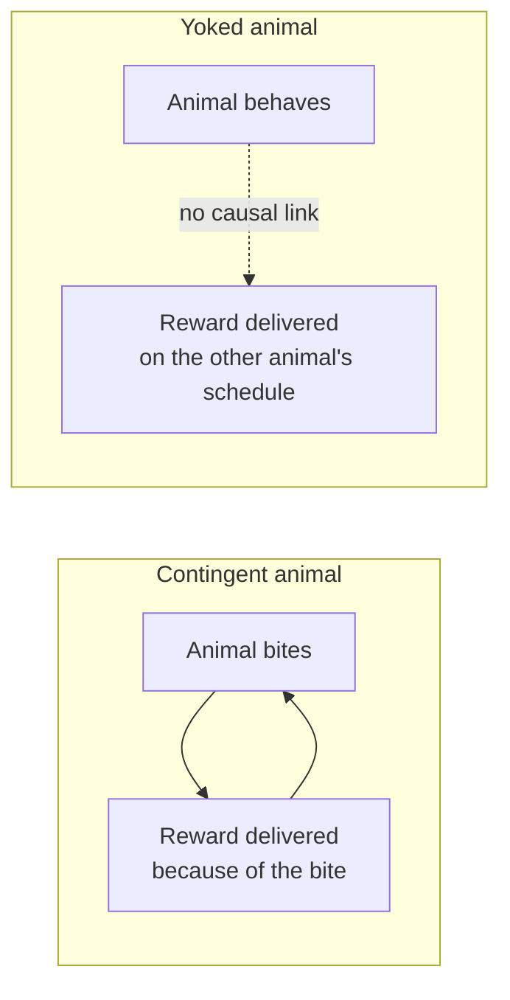
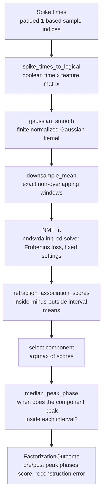
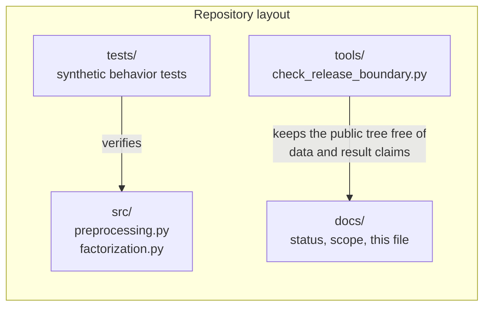

# Extended Introduction: Temporal Credit Assignment in *Aplysia*

This document is a from-scratch introduction for readers with **no neuroscience background**. It explains every idea in plain language with analogies, then shows how the ideas map onto the actual code in this repository. For the shorter, technical introduction with formal citations, see [docs/INTRODUCTION.md](INTRODUCTION.md).

## 1. The sea slug that taught us about learning

*Aplysia californica* is a large sea slug. It is famous in biology for a simple reason: its nervous system is small and its neurons are enormous. Where a human brain has on the order of 86 billion neurons, *Aplysia* has on the order of 20,000, and some of them are so large (up to a millimeter across) that you can see them with the naked eye and record from the same identified cell, in the same location, in animal after animal. That tractability made *Aplysia* a workhorse of learning research — the body of work for which Eric Kandel received a share of the 2000 Nobel Prize in Physiology or Medicine.

Think of it this way. If you wanted to understand how a factory works, you would rather start with a workshop of twenty machines you can each name and watch than with a city of a billion machines you cannot distinguish. *Aplysia* is that workshop. In particular, its **feeding network** — the small set of neurons that drives the animal's biting and swallowing — can be recorded while the animal learns, and the same experiment can be repeated on an isolated preparation of that network [9].

## 2. Operant learning: "do something, get a reward"

**Operant learning** (also called instrumental conditioning) is the kind of learning where an animal discovers that its own action produces a consequence. A rat presses a lever and gets food; it presses more. A sea slug performs a biting movement and receives a reinforcing nerve stimulation; the pattern of its feeding movements changes [2].

The key experimental trick is the **yoked control**. Two animals receive the *same* rewards on the *same* schedule. For the **contingent** animal, the reward is caused by its own behavior. For the **yoked** animal, rewards arrive on a recording of the first animal's schedule, regardless of what the yoked animal does. Both animals experience identical reward timing; only the *relationship between action and reward* differs. If the two animals end up behaving or firing differently, the difference must come from contingency — from the animal's own action being the cause — rather than from reward exposure alone.

## 3. Temporal credit assignment: which earlier signal caused the later outcome?

Here is a puzzle you already know from daily life. You eat a meal with ten ingredients; two hours later you feel sick. Which ingredient was responsible? The outcome is delayed, and everything that happened beforehand is a suspect. Assigning credit to the right earlier cause is the **temporal credit-assignment problem** [1].

A nervous system faces this constantly. Neural activity unfolds continuously, and a reward arrives at one moment. The brain must decide which earlier patterns of activity deserve to be strengthened. This repository studies a concrete version of the question: after operant training in *Aplysia*, does the *timing* of a neural activity pattern shift in the contingent animals relative to the yoked controls — for example, does a component of population activity peak *earlier* within each behavior cycle? Formal learning theory (e.g., temporal-difference learning [8]) solves the same problem mathematically by propagating credit backward from outcomes to earlier predictions.

## 4. Non-negative matrix factorization: splitting a mixed recipe into pure ingredients

A recording of many neurons over time is a big table of numbers: one row per time point, one column per neuron. It is hard to look at directly. **Non-negative matrix factorization (NMF)** is a way to summarize it [5].

The recipe analogy: imagine you taste a smoothie and want to recover the recipe. NMF assumes the smoothie (the full recording) is a blend of a small number of *pure ingredients* (recurring spatial patterns across neurons), each added in a *time-varying amount* (how strongly that pattern is active at each moment). The non-negativity rule says you can only *add* ingredients, never subtract them — which matches neural firing, since a neuron cannot fire a negative number of spikes. The result is an approximation:

> **Recording ≈ (time-varying weights) × (recurring patterns)**

A crucial caution, which this repository takes seriously: a component is a *statistical description*, not a discovered neuron or mechanism [4]. It is a useful compression, and its timing can be measured objectively — but calling it biology requires more than a good fit [6].

## 5. Why synthetic time series with known ground truth?

Here is the deepest problem in testing an analysis method: with real data, you never know the right answer. If your method says "component 2 peaks early," is that true of the neurons, or an artifact of your smoothing?

The escape is **synthetic data**. We *generate* an Aplysia-inspired time series ourselves — spike times, smoothing, intervals — so we know the ground truth by construction. Then we check whether the code recovers what we put in. That is exactly what this repository's test suite does: every test in `tests/` builds a tiny in-memory array with a known answer (for example, `test_retraction_association_scores_favors_interval_enrichment` plants a component enriched in a known interval and checks that the scoring rule finds it). These tests verify **code behavior**; they do not, by themselves, prove anything about real animals. The repo says this explicitly in its [methods scope](METHODS_SCOPE.md), and its open issues (#9–#14) ask for more synthetic tests of exactly this kind.

## 6. How the pieces fit together

The pipeline above is literally `fit_primary_factorization` in `src/factorization.py`. It is run separately on a "pre" (before-training) and "post" (after-training) activity segment, and the scientific contrast compares the selected component's peak phase between them, for a contingent animal versus its yoked partner.

## 7. The math that is actually used — one sentence each

- **NMF objective (Frobenius loss).** The code asks scikit-learn's NMF to find non-negative weight and pattern matrices whose product is as close as possible to the recording, where "close" is measured by the Frobenius error — the sum of squared differences between every entry of the recording and its approximation, exactly like ordinary least-squares line-fitting but for a whole table. (Beginner link: [StatQuest on matrix factorization](https://www.youtube.com/c/joshstarmer); [3Blue1Brown, Essence of Linear Algebra](https://www.3blue1brown.com/topics/linear-algebra) for the matrix-multiplication intuition.)
- **Retraction-association score.** For each component, subtract its average activity *outside* the behavior intervals from its average *inside* them; a positive score means the component is enriched during the behavior of interest, and `fit_primary_factorization` selects the component with the largest score. ([Khan Academy: measures of central tendency](https://www.khanacademy.org/math/statistics-probability/summarizing-quantitative-data))
- **Median peak phase.** Within each behavior interval, find where the selected component reaches its maximum (expressed as a fraction 0–1 of the interval, with ties broken toward the earliest maximum), then take the median across intervals so one odd interval cannot dominate. ([Khan Academy: median](https://www.khanacademy.org/math/statistics-probability); [Seeing Theory](https://seeing-theory.brown.edu/) for interactive statistics intuition.)
- **Gaussian smoothing.** Each spike train is blurred with a bell-shaped kernel (standard deviation 1000 samples, finite half-window 2500 samples, renormalized to sum to one) so that sharp spike events become a smooth activity level — like replacing a series of camera flashes with a gentle brightness curve.

## 8. What this project concluded — and did not

The completed re-analysis found a **directionally negative** contingent-minus-yoked timing pattern in most matched pairs, and the direction survived leaving any single pair out. But the contrast was not stable under the planned component-count and smoothing sensitivity checks, and a comparison with an archived reference workflow agreed only partially. The honest bottom line, stated in the README and [status document](STATUS_AND_PLAN.md), is: **directionally suggestive but inconclusive**. No causal, mechanistic, or exact-replication claim is made, and the reference MATLAB/seqNMF workflow was not rerun.

## References

References are the repository's own verified list from [docs/INTRODUCTION.md](INTRODUCTION.md); nothing here is invented. Key entries used above:

[1]: https://doi.org/10.1371/journal.pcbi.1002092 "Friedrich, Urbanczik, and Senn (2011), Spatio-temporal credit assignment in neuronal population learning"
[2]: https://doi.org/10.1126/science.1069434 "Brembs et al. (2002), Operant reward learning in Aplysia: neuronal correlates and mechanisms"
[4]: https://doi.org/10.1038/nn.3776 "Cunningham and Yu (2014), Dimensionality reduction for large-scale neural recordings"
[5]: https://doi.org/10.1038/44565 "Lee and Seung (1999), Learning the parts of objects by non-negative matrix factorization"
[6]: https://doi.org/10.7554/eLife.38471 "Mackevicius et al. (2019), Unsupervised discovery of temporal sequences in high-dimensional datasets"
[8]: https://doi.org/10.1007/BF00115009 "Sutton (1988), Learning to predict by the methods of temporal differences"
[9]: https://doi.org/10.1523/JNEUROSCI.19-06-02247.1999 "Nargeot, Baxter, and Byrne (1999), In vitro analog of operant conditioning in Aplysia. I."

(Full 15-item reference list: see [docs/INTRODUCTION.md](INTRODUCTION.md).)
