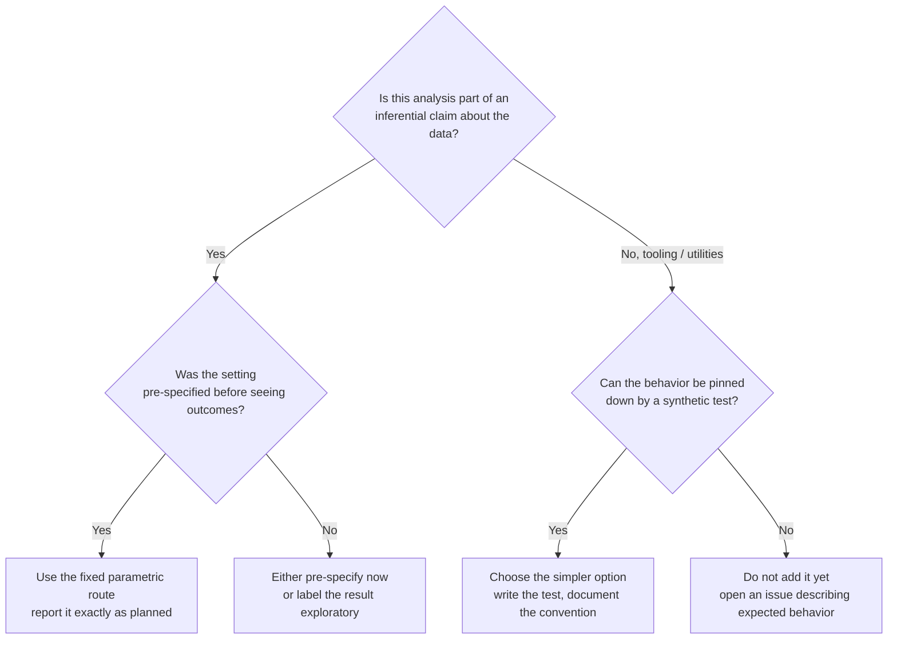

# Methods Guide for New Contributors

Audience: contributors who are new to data science. This guide explains what the code in this repository **already does**, what is **deliberately not done**, why the design choices were made, and how to work hygienically. It is grounded in the actual source (`src/`), tests (`tests/`), and open issues — read it alongside [docs/METHODS_SCOPE.md](METHODS_SCOPE.md) and [docs/STATUS_AND_PLAN.md](STATUS_AND_PLAN.md).

## Done

These capabilities exist in code and are covered by synthetic tests:

| Capability | Where | Verified by |
|---|---|---|
| Convert padded one-based spike indices to a boolean time-by-feature matrix (zeros/NaN = padding; non-integral or out-of-range indices rejected) | `src/preprocessing.py::spike_times_to_logical` | `tests/test_preprocessing.py` |
| Gaussian smoothing with a finite, renormalized kernel; center-trimmed back to the input length | `src/preprocessing.py::gaussian_smooth` | `tests/test_preprocessing.py` (shape, non-negativity, finiteness, invalid-parameter rejection) |
| Exact mean-downsampling in non-overlapping windows; refuses uneven time axes | `src/factorization.py::downsample_mean` | `tests/test_factorization.py` |
| Normalize one-based sample boundaries to sorted, inclusive, zero-based bin intervals | `src/factorization.py::normalise_intervals` | `tests/test_factorization.py` |
| Build inclusive interval masks; score components by inside-minus-outside mean activity | `src/factorization.py::interval_mask`, `retraction_association_scores` | `tests/test_factorization.py` |
| Median within-interval peak phase (normalized 0–1, earliest maximum wins ties, single-bin intervals get phase 0) | `src/factorization.py::median_peak_phase` | `tests/test_factorization.py` |
| Deterministic end-to-end NMF pipeline over caller-provided pre/post segments | `src/factorization.py::fit_primary_factorization` | exercised via its sub-utilities; fixed scikit-learn settings make it deterministic |
| Release-boundary scanner that checks tracked text/paths for boundary violations | `tools/check_release_boundary.py` | run manually via `python tools/check_release_boundary.py` |

A completed deterministic re-analysis (documented in [docs/STATUS_AND_PLAN.md](STATUS_AND_PLAN.md)) found a directionally negative contingent-minus-yoked timing contrast in most matched pairs — **directionally suggestive but inconclusive**, because the contrast was not stable across planned component-count and smoothing checks.

## Intended

These are open or deferred directions, drawn from open issues. None of them exist in code yet:

- **More synthetic edge-case tests** (data-free, contributor-safe): zero-half-window smoothing (#11), padding handling in spike conversion (#10), single-bin phase behavior (#14), interval ordering (#13).
- **Documentation clarifications**: finite-kernel behavior in `gaussian_smooth` (#9), adjacent-window semantics in `downsample_mean` (#12), the scanner's human-review limit (#15).
- **Gated research work** (blocked pending scientific review and maintainer approval): a pre-specified timing-evaluation protocol (#17) and a reference-workflow comparison protocol (#18), plus planning of the scientific-owner gate (#16). These would run on governed data *outside* this public tree.
- Explicitly **not** in scope: bundled datasets, data loaders, output writers, figure generators, or any execution of the archived MATLAB/seqNMF reference workflow (see [METHODS_SCOPE.md](METHODS_SCOPE.md)).

## Design decisions and why

**1. Caller-provided arrays only; no I/O.** Every public function takes arrays and returns arrays. Nothing reads files, downloads data, or writes outputs. *Why:* it keeps the public tree free of research data and derived results (enforced by `tools/check_release_boundary.py` and [RELEASE_BOUNDARY.md](RELEASE_BOUNDARY.md)), and it makes every function testable in memory.

**2. Determinism by construction.** The NMF helper uses `init="nndsvda"`, `solver="cd"`, `beta_loss="frobenius"`, `tol=1e-4`, `shuffle=False`, and no random state — nndsvda is a deterministic SVD-based initializer, so repeated runs on the same input give the same fit. *Why:* deterministic code makes disagreements reviewable; a random pipeline lets a favorable run be cherry-picked.

**3. Fixed default preprocessing.** Defaults (acquisition 1000 Hz, 120 s duration, smoothing SD 1000 samples, half-window 2500 samples, downsample factor 10) mirror the completed re-analysis route. *Why:* defaults encode the pre-specified analysis, so sensitivity checks are explicit parameter changes rather than hidden edits.

**4. Inclusive, zero-based, sorted intervals with strict validation.** Inputs are one-based sample indices (matching upstream conventions) and are converted explicitly; invalid shapes, non-finite values, empty masks, or full-coverage intervals raise `ValueError`. *Why:* silent off-by-one errors are the classic failure mode of time-series code; the tests pin down the exact conventions (e.g., `normalise_intervals([1, 20], 10) == [[0, 1]]`).

**5. Objective component selection.** The selected component is `argmax` of the inside-minus-outside interval score, computed by code rather than by eye. *Why:* pre-specified selection rules prevent a researcher from choosing whichever component tells the nicest story.

### Undecided questions — both options and a selection rule

- **NMF variant.** Option A: keep plain Frobenius NMF (current). Option B: use a convolutional/sequence-aware variant such as seqNMF, which models temporal motifs directly. *Selection rule:* plain NMF remains the default because it is deterministic, already validated by synthetic tests, and matches the completed route; a sequence-aware variant may only be adopted as a *pre-specified* follow-up with its own protocol (issue #18), never swapped in after seeing outcomes.
- **Rank (component count) selection.** Option A: fix the count in advance (the completed route used a fixed count, default `n_components=2` in the helper). Option B: choose the count by a data-driven criterion such as reconstruction-error curvature or cross-validation. *Selection rule:* fix in advance for any inferential claim; data-driven rank choice is exploratory only and must be reported as such, because the completed sensitivity checks showed conclusions can move with the count.
- **Convergence criteria.** Option A: fixed `max_iter=1000`, `tol=1e-4` (current). Option B: adaptive restarts until a stability target is met. *Selection rule:* keep fixed settings for the reference route; if restarts are ever introduced, use *multiple* recorded seeds and report the spread of solutions, because NMF loss surfaces have local optima (see Hygiene below).

## Parametric vs non-parametric: a decision guide

"Parametric" methods assume a specific functional form with a fixed number of knobs (e.g., a Gaussian kernel with a chosen SD, or NMF with a fixed rank). "Non-parametric" methods let the data dictate complexity (e.g., rank chosen by cross-validation, kernel density estimates with data-driven bandwidths).

Concrete rules of thumb used in this repo:

1. **Anything feeding a conclusion is parametric and pre-specified.** Component count, smoothing SD, downsampling factor, and tolerance are fixed before outcomes are reviewed; post-hoc favorable-setting selection is explicitly out of bounds ([STATUS_AND_PLAN.md](STATUS_AND_PLAN.md)).
2. **Complexity must justify itself.** If a flexible method (more components, adaptive bandwidth) changes the answer, that instability is a *result to report*, not a setting to tune away — this is exactly why the completed analysis is labeled inconclusive.
3. **Utilities stay simple and deterministic.** For helper code, prefer the option whose behavior can be fully described in a docstring and checked by a small synthetic test.
4. **Pre-specification beats sophistication.** A crude method with an honest protocol outranks an elegant method tuned after the fact.

## Hygiene: how to work in this repo

- **Seeds and determinism.** Prefer deterministic paths. If randomness is ever unavoidable, record the seed, run multiple restarts, and report the distribution of outcomes — NMF can converge to local optima, so a single lucky run is not evidence.
- **Synthetic ground truth.** Every behavior change needs an in-memory synthetic test where the correct answer is known by construction. Tests must not read local data or write to data/result/figure paths (see [CONTRIBUTING.md](../CONTRIBUTING.md)). Open issues #9–#14 and #5 are the template.
- **Test discipline.** Run `python -m pytest -q` and `python tools/check_release_boundary.py` before proposing a change (per the README). Add tests *with* the change, not after.
- **Scope language.** Synthetic tests verify *code behavior*, never empirical hypotheses — keep that distinction explicit in any prose you write (this is itself open issue territory, e.g., #12, #15).
- **Public boundary.** No data, derived tables, figures, notebooks, or numerical result claims in the tree. When unsure whether wording crosses the boundary, compare against [RELEASE_BOUNDARY.md](RELEASE_BOUNDARY.md) and ask in an issue first.

## Where to start

Good first contributions are the `good first issue` / `contributor-safe` items (#9–#15): small synthetic tests and prose clarifications. Research-facing work (#16–#18) requires maintainer approval and a pre-specified plan; do not begin it in a pull request.
