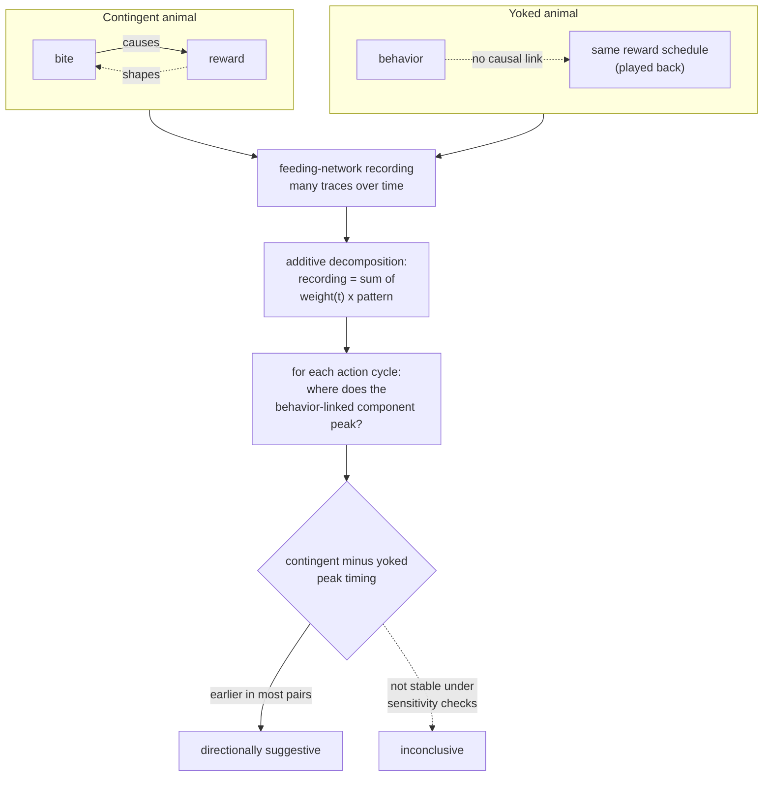

# Concept Figure: Contingent versus Yoked, and the Timing Question

This file is the tracked, text-only stand-in for the repository's concept
figure. The public release boundary does not permit image files or figure
directories in the tracked tree (see `tools/check_release_boundary.py` and
[RELEASE_BOUNDARY.md](RELEASE_BOUNDARY.md)), so the figure is expressed here
as a Mermaid diagram that any Markdown viewer with Mermaid support renders
automatically.

**Caption:** The experiment and the analysis in one picture. Two animals get
identical rewards on identical schedules, but only the contingent animal's
own bites cause the reward. Recordings from the feeding network are
compressed into a few additive components, and the question is a timing
question: after training, does the behavior-linked component peak earlier
within each action cycle in contingent animals than in yoked partners?

Reading the diagram:

1. The **yoked design** is the control that isolates contingency: reward
   exposure is identical, only the action–outcome link differs.
2. The recording is summarized as a small sum of recurring patterns with
   time-varying strengths — the worked arithmetic is in
   [EXTENDED_INTRODUCTION.md](EXTENDED_INTRODUCTION.md), section 4.
3. The scientific contrast is a *timing* contrast (peak position within each
   cycle), computed per matched pair.
4. The repository's recorded outcome is deliberately two-boxed: a
   directional pattern, but not a stable or conclusive one.
